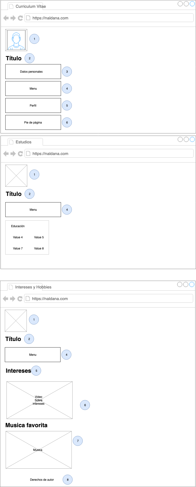

# Tarea 1

## Instrucciones

Escriba una página Web que cumpla con los requisitos listados utilizando los conocimientos adquiridos en las clases de HTML, además haga uso del sistema de control de versiones GIT.

## Sobre GIT

Haga uso de su repositorio "Portafolio" cree una carpeta llamada "Tarea1" directorio donde debe ser almacenada la página web solicitada. Los commit's que formen parte en su repositorio relacionados con la tarea deberán tener el prefijo \[Tarea1\] y luego un mensaje que describan los cambios.

Es necesario que al finalizar el desarrollo de la página haya realizado por lo menos 4 commit con mensajes adecuados por Ej.

1. \[Tarea1\] Add: Pagina principal
2. \[Tarea1\] Add: Contendio Multimedia
3. \[Tarea1\] Fix: Datos personales
4. \[Tarea1\] Add: Pagina hobbies

## Sobre entrega

La tarea deberá ser entregada a través de la plataforma moodle, con un enlace a su repositorio publico de GitHub. Los Commit que modifiquen el código fuente despues del tiempo establecido no se tomaran en cuenta.

## Requisitos

Cree una página web de tipo "About me", que contenga los siguientes aspectos:

- Nombre, Apellido.
- Breve descripción personal.
- Datos generales.
- Carnet.
- Año de estudio.
- Carrera.
- Correo.
- Github.
- Habilidades y conocimientos.
- Nivel académico (pre grado, grado, inglés, cursos, etc).
- Experiencia laboral.
- Intereses y hobbies.
- Incluya imágenes ilustrativas, vídeos y enlaces externos.

No incluya datos sensibles como direcciones, teléfonos, documentos personales)

El sitio web debe de estar conformado por lo menos por 3 páginas. Implemente un sistema de navegación dentro del mismo.

Debe hacer uso de las etiquetas de HTML5 Semántico (Secciones, artículos, énfasis, etc) para estructurar su página, y todos los elementos vistos hasta el momento en clase (puede investigar y hacer uso de otras etiquetas).

## Entrega

La tarea deberá ser entregada a través de la plataforma moodle, con un enlace a la carpeta de la Tarea en su repositorio publico de GitHub. Los Commit que modifiquen el código fuente despues del tiempo establecido no se tomaran en cuenta.

Fecha límite: <Insert Date>.

## Anexos

